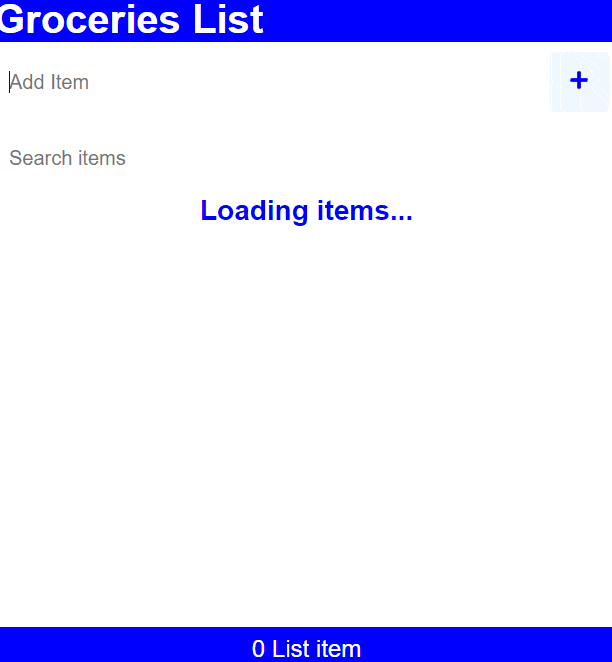

# Groceries List :ledger:

Application created with [React](https://reactjs.org/) and [Vite](https://vitejs.dev/).


The app uses [functional components](https://reactjs.org/docs/components-and-props.html#function-and-class-components) and the [useState](https://reactjs.org/docs/hooks-state.html), [useEffect](https://reactjs.org/docs/hooks-effect.html) and [useRef hooks](https://beta.reactjs.org/reference/react/useRef). It interacts with a [json-server](https://github.com/typicode/json-server) simulated [REST API](https://www.redhat.com/en/topics/api/what-is-a-rest-api) and supports all [CRUD operations](https://developer.mozilla.org/en-US/docs/Glossary/CRUD). It `fetch()` the list stored in the database on loading, then allows the user to create, update or delete its elements and search among them.



## Requirements

* npm 
* Git
* CLI

## Setup

Clone the repo and install the dependencies:

```bash
git clone https://github.com/pathei-kosmos/groceries-list
cd groceries-list
```

```bash
npm install
```

Launch the API :

```
npx json-server -p 3500 -w data/db.json

```

Launch the live server:
```bash
npm run dev
```

